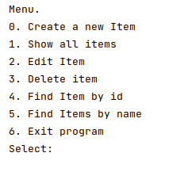

# job4j_tracker

[](https://travis-ci.org/amasterenko/job4j_tracker)
[](https://codecov.io/gh/amasterenko/job4j_tracker)  
___  
This is a Java learning project: items CRUD operations.   
#### Used technologies
* Java Core  
* JUnit  
* Maven
* Hibernate  
* PostgreSQL
* LiquiBase
* Travis C.I.
* JaCoCo

#### Usage  
1. Create db _tracker_, specify db settings in _pom.xml_ and _app.properties_.
2. Build the project: ```mvn clean package``` 
3. Run application: ```java -jar target/tracker.jar```  
#### User interface  
 
